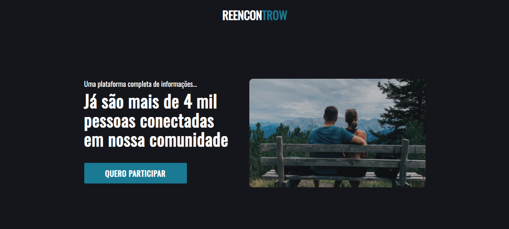
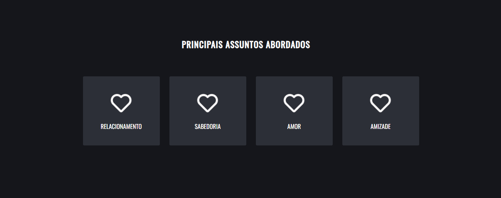
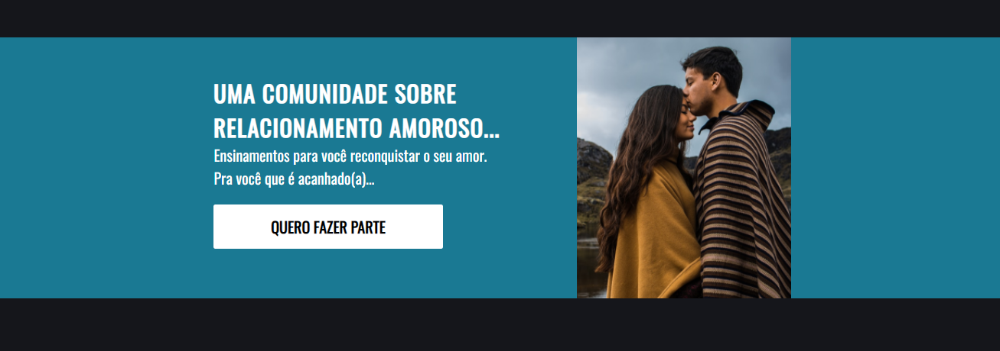
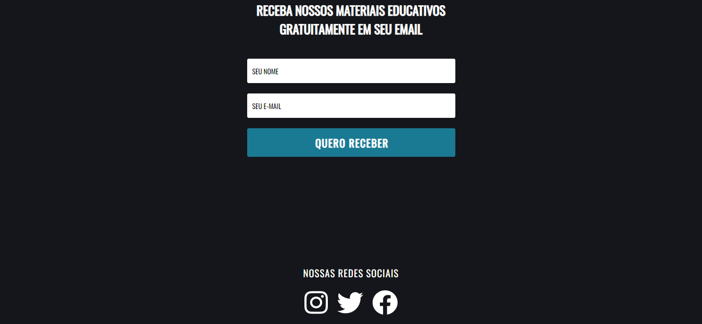

# Reencontrow - landingpage

Landing page desenvolvida para uma comunidade de encontros online, Reencontrow.

 
 
 
 

## Feito Com:

## 🤝 Contribuição

Projeto criado por Suzana Fonseca, seguindo o modelo de
Jefferson Vasconcellos: https://www.youtube.com/watch?v=EA7rYIdF_9g

### Contato

